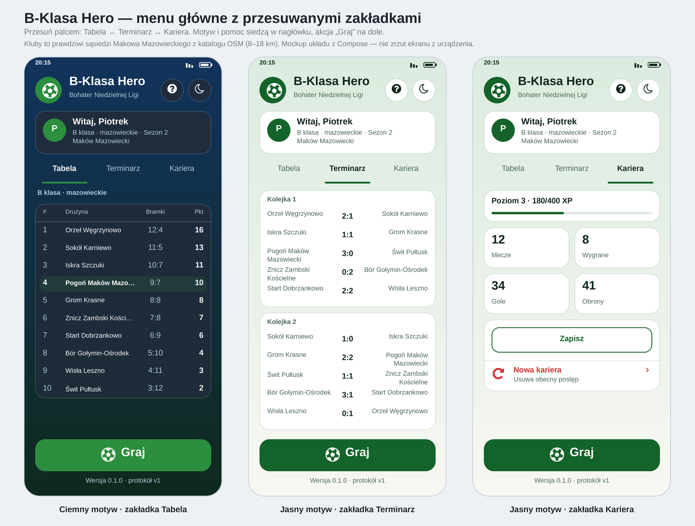

# B-Klasa Hero

> Penalty shootouts + career in the Polish football pyramid. 100% offline,
> 100% open-source, zero telemetry.

_"B-Klasa Hero"_ (znane też jako _"Sunday League Hero"_) to mobilna gra
piłkarska w całości offline. Zaczynasz od B klasy, strzelasz karne,
zbierasz punkty i — jeśli dopisze ci szczęście w sędziowskich
doliczonych — awansujesz do Ekstraklasy.

W grze:

- **5 rzutów karnych** z fizyką (grawitacja, opór powietrza,
  efekt Magnusa, słupki i poprzeczka).
- **Kariera przez 8 poziomów** polskiej piramidy piłkarskiej.
- **Proceduralne nazwy klubów** (żadnych prawdziwych herbów ani
  ryzyka naruszenia znaków towarowych).
- **~7 800 polskich miejscowości** z OpenStreetMap (ODbL).
- **Zerowe uprawnienia**. Zero sieci. Zero reklam.

## Zrzuty ekranu

Podgląd menu głównego (mockup układu z `HomeScreen.kt`, nie zrzut z urządzenia —
odświeżysz go przez `python3 tools/preview/render_menu_mockup.py docs/menu-preview.png`):



_Zrzuty z urządzenia: do dodania przed pierwszym release._

## Jak zbudować

```bash
# Testy rdzenia C++ (szybko, bez NDK/JDK):
scripts/build-core-tests.sh

# APK debug (potrzebujesz JDK 17 + Android SDK 35 + NDK 27.2.12479018):
cd android && ./gradlew :app:assembleDebug
```

Szczegóły (w tym build offline dla F-Droid): [`docs/BUILD.md`](docs/BUILD.md).

## Jak grać

1. Podaj nick i wybierz swoje miasto — aplikacja wygeneruje lokalne kluby.
2. Zagraj mecz: **5 rzutów karnych** (tap na bramkę = strzał) i **5 obron**.
3. Awansuj z B klasy przez 8 lig aż do Ekstraklasy (top-2 awans, bottom-2 spadek).

## Sekrety CI (release)

Workflow [`release.yml`](.github/workflows/release.yml) podpisuje APK dla
GitHub Releases. Wymaga sekretów repo:

| Sekret | Opis |
|---|---|
| `RELEASE_KEYSTORE_BASE64` | keystore JKS zakodowany base64 |
| `RELEASE_STORE_PASSWORD` | hasło keystore |
| `RELEASE_KEY_ALIAS` | alias klucza |
| `RELEASE_KEY_PASSWORD` | hasło klucza |

Klucz wygenerujesz przez `scripts/make-keystore.sh` (NIE commitować `*.jks`).

## Jak dodać tłumaczenie

Pliki w `android/app/src/main/res/values-<locale>/strings.xml`.
Dodaj nowy `<locale>` i tłumacz — tyle. Zgłoś PR.

## Architektura

Szczegóły w [`docs/ADR/`](docs/ADR):

1. [Granice rdzenia](docs/ADR/0001-core-boundaries.md)
2. [Flagi kompilacji](docs/ADR/0002-build-flags.md)
3. [Format save'a](docs/ADR/0003-save-format.md)
4. [Źródła danych](docs/ADR/0004-data-sources.md)
5. [Wersjonowanie protokołu](docs/ADR/0005-protocol-versioning.md)
6. [Fikcyjne kluby](docs/ADR/0006-fictional-clubs.md)

## Licencja

- **Kod**: GPL-3.0-or-later.
- **Grafiki**: CC0.
- **Dane miejscowości**: OpenStreetMap, ODbL — atrybucja w
  [`data/places/ATTRIBUTION.md`](data/places/ATTRIBUTION.md).

## Kontakt

- Issues: zakładka _Issues_ w repo.
- Prywatność: patrz [`docs/PRIVACY.md`](docs/PRIVACY.md).
- Bezpieczeństwo: e-mail na stronie About w grze (TBD przed 1.0).

## Status

Patrz [`docs/STATUS.md`](docs/STATUS.md).

---

"B-Klasa Hero" nie jest powiązane z żadnym klubem piłkarskim, ligą
ani federacją. Wszystkie nazwy klubów są generowane algorytmicznie,
a wyniki symulowane.